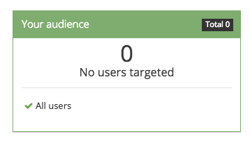
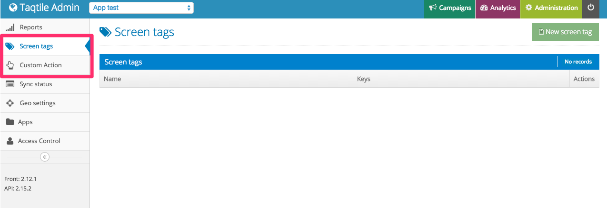

# FAQ

## Push Notifications

### My push notifications are not arriving to the phone, what is wrong?

This is the most common cause of complaints. If this happens there are some things you can do if we are not available or if you want to be sure you are doing everything right.

- Make sure you are connected to the internet
- Make sure that you have selected the right application:

- Check the filters and audience number on the push screen:

(this guy with zero users targeted will never get the push, for example)

- Have you opened the app after installing? You have to do this in order to TQ1 to register your device
- Make sure the push notifications are enabled on your device
- If your app send any custom data, make sure it matches the custom data you are using to filter the users

### How do I add a custom filter?

The custom filters must be sent from the app to the server. As soon as the app sends a custom filter to us, it will start showing on the custom filter settings.

## Campaigns and geonotifications

### I'm inside a geofence and the push didn't arrive, what is happening?

Ok, first be sure that you are getting normal push notifications, this way we can be sure that the problem is specifically related to geonotifications.

If you are receiving the normal push notifications:

- Is your location enabled for the application?
- Check the event that is set on campaign, if you enter the fence and the event is linger, you won't receive the notification when entering it.
- Check if you are not in the notification interval set when the campaign is created
Also check if the fence is associated to the campaign and the campaign dates are also right

### How can I test a campaign?

Well, the simplest way to test a campaign is to walk through the fences. But we know sometimes this is impossible, so there are a few options:

- Create a geofence on the place you are and put it in the same category of the campaign, this way you won't have to move a lot in order to test it
- If you are using iOS, you can run another application on developer mode and fake the location through XCode
- If you are using Android, you can download a GPS faker and easily fake notifications
- If you are using Windows Phone, you won't receive geonotifications

## System and app

### My frontend screen keeps loading and at the end I get an error

The first thing to do in this case is a logout and login.

Sometimes when we update the system or your authentication expires, this error happens.

If you do it and still getting the error, there could be something wrong with the server.

### How do I create Screen Tags and Custom Actions?

In order to create Screen Tags and Custom Actions, you have to go to TQ1 "Administration" section. Then you will see the options on the left side of the screen:

