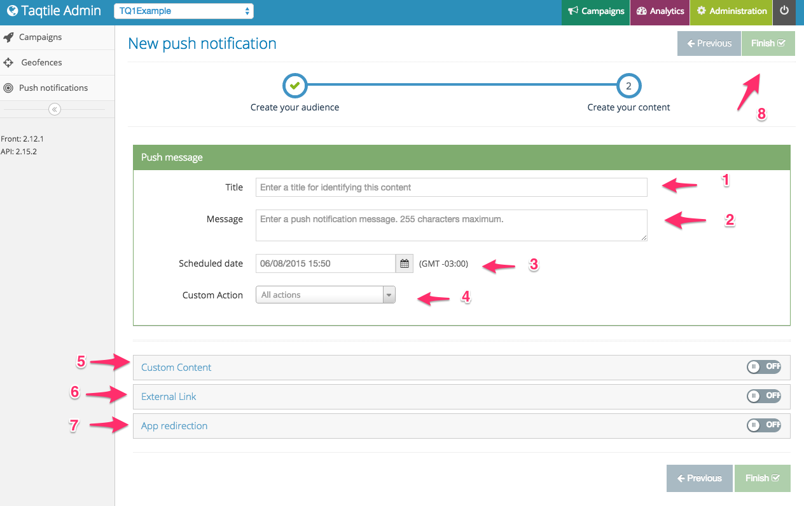

# Admin Overview

The TQ1 admin can be divided in 3 sections:

### Analytics

Here you will find information about users, devices and campaigns.

### Campaigns

Here you will be able to manage your campaigns, send push notifications and manage the geofences.

### Administration

Here you will be able to manage and view information about your apps, screen tags, check server status and other settings as well.

## Sending push notifications

Once logged to TQ1, choose the desired application on the top left corner.

Once you've done this, click on *Campaigns* on the top right corner and then click on *Push notifications* on the left menu and then click on the *New push notification* green button.

You will be taken to a screen like this:

0. Select the platform you want to send your push notification to
0. If there is any custom filter set and you want to use it, add it here
0. You will be able to see the number of users your settings are targeting and a description of all filters used
0. Click on *Next* button to go to the next page

Now you will add content to your push notification:

0. The title will be shown for TQ1 users only, in order to identify the the push notification
0. Message is the text that will be displayed to the user when sending the push notification
0. This is when the push should be sent
0. If your app supports custom action, that is those buttons that appear on push notifications, here you will set it
0. Here you can put anything in order to be exhibited on the app, it will be sent as an HTML text
0. Here you add an URL that will be handled by the app
0. Here you will set tags used to navigate to a page inside the application
0. Click on *Finish* when you are done.

## Creating Campaigns

This solution will assume that you already know how to send a normal.

In order to create campaigns, you must first have your geofences created:

0. Click on the "Geofences" option on the left side menu
0. Create a new category by clicking the "New Category" button (You will use categories - as a group of fences - when dealing with campaigns, so group your fences accordingly)
0. Type a name for your new category and click the "Create" button

0. Select the desired category
0. Click the *New Fence* button

0. Type an address or navigate through the map
0. Click on the map where you want your fence to be (you can add as many fences you want) and select it's radius
0. Click the *Finish* button and your fence will be added to the category

Now that we have a category filled with fences we are ready to create a campaign. To do so, click on campaigns on the left menu:

Click on the *New Campaign* button and you will be directed to the new campaign screen:

0. Selected the type of campaign, you can create limited or unlimited campaigns
0. Add a title for the campaign, this will be used to identify it
0. Select a date when the pushes will start to be sent
0. If applicable, select the date when your campaign will finish and then click the "Save" button

Click on the *Add/Edit content*

Press the Add content button and choose the type of your push. You will then create the push similarly as you do when sending a normal push notification, once done you will have something like this:

Press the *Edit geotrigger* button

0. Select the days of week you want the users to receive pushes from your campaign
0. Select the time range (if you want the users to just receive push notifications on lunch time for example)
0. Select the time interval that your pushes will be sent to the same users to avoid spamming
0. Select the geofences category with the desired locations
0. Click the finish button

And it's done, after these steps you will have a working campaign
