# TQ1 Requirements

This file describes the requirements of any Android, iOS or Windows project to be considered ready for the TQ1 services.

## TL;DR

**For Android applications you must have:**

- Your application registered at **Google Developers Console**.
- **Google Cloud Messaging for Android** API enabled.
- You need an **API KEY** for server access without IPs restriction.

**For development iOS applications you must have:**

- Your application registered at **iOS Developer Portal**.
- **Push Notifications** services enabled.
- An Apple Push Notification service SSL (Sandbox) certificate exported as a **.p12 file**.
- The **password** for the above specified certificate.

**For staging or production iOS applications you must have:**

- Your application registered at **iOS Developer Portal**.
- **Push Notifications** services enabled.
- An Apple Push Notification service SSL (Production) certificate exported as a **.p12 file**.
- The **password** for the above specified certificate.

**For Windows Phone Silverlight applications (8.+) you must have:**

- Your application registered at **Windows Phone Dev Center**.

**For Windows Phone Store applications you must have:**

- Your application registered at **Windows Phone Dev Center**.
- A **Package Security Identifier (SID)** for API authentication.
- A **Client secret** for API authentication.

## Android

**This guide assumes that:**

- You have a Google Account for your Android applications. Otherwise you can create one [here](https://accounts.google.com/SignUp/).

### Development, Staging and Production
Then keep going with the following items

1. Access your [Google Developers Console](https://console.developers.google.com/project/).
2. Create a project.

    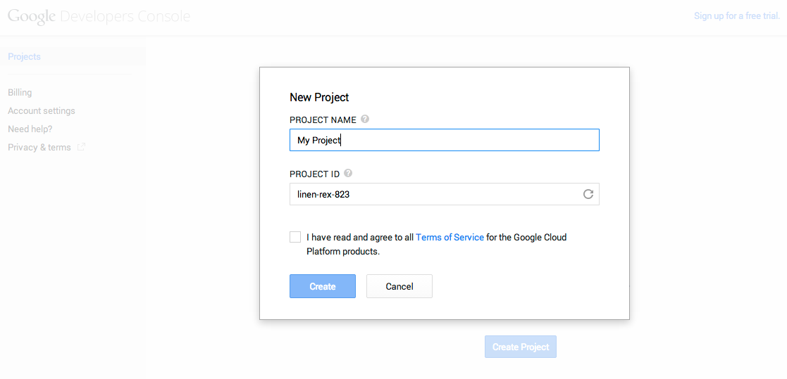

3. When the operation finishes, you can already see your unique 12-digit application identifier, the **Project Number**.

    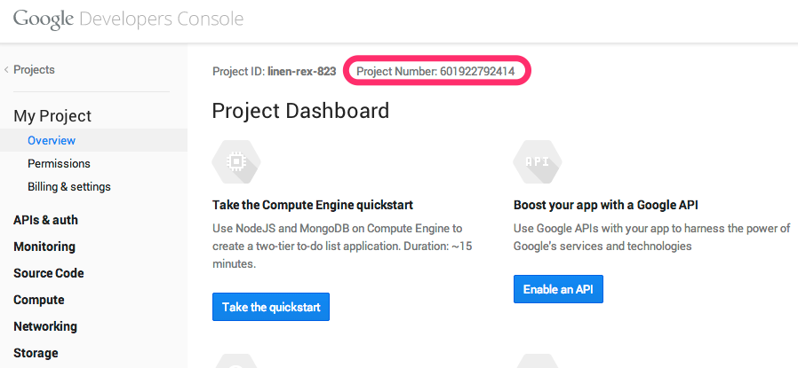

4. Enable the GCM for Android API by browsing to *APIs & auth > APIs* and turning ON the *Google Cloud Messaging for Android* toggle selector.

    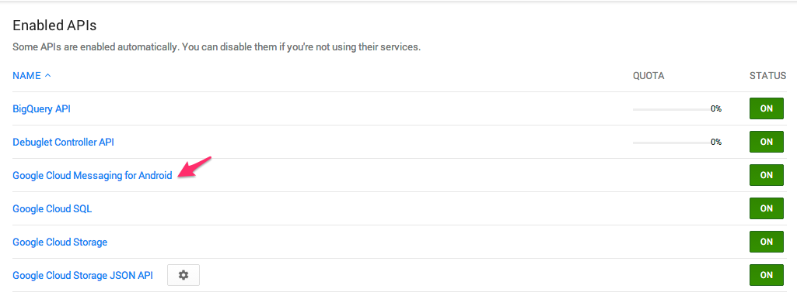

5. Create a Server key for public API access.
  1. Navigate to *APIs & auth > Credentials*.
  2. In *Public API access*, select *Create new key*.
  3. Select the *Server key*.
  4. Leave the IP addresses form empty, then click *Create*.
    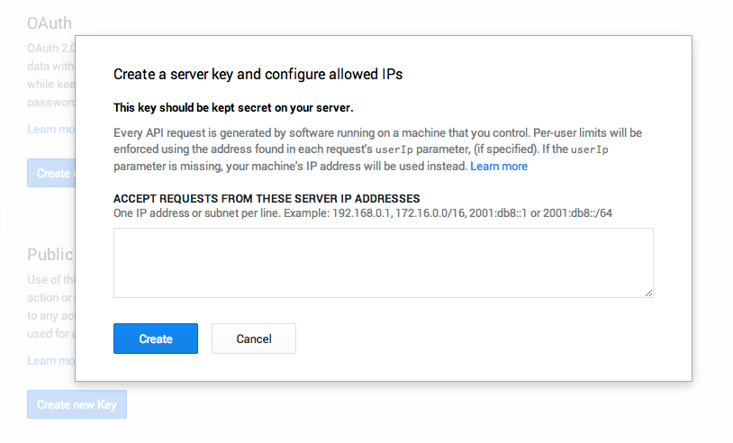
  5. After that you will be able to see the **API KEY**.
  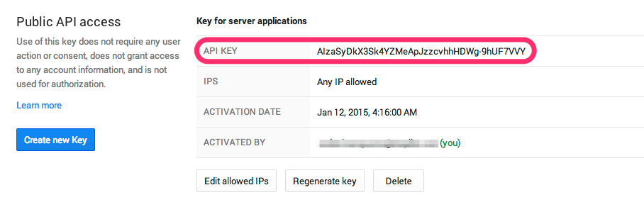
6. The **API KEY** is required for the TQ1 setup.

## iOS

**This guide assumes that:**

- You have an Apple Account and you are registered in an iOS Developers Program. Otherwise you can follow [these instructions](https://developer.apple.com/programs/ios/).

### Development
Then keep going with the following items

1. Access your [iOS Developer Portal](https://developer.apple.com/account/overview.action/).
2. Find the identifiers section.

    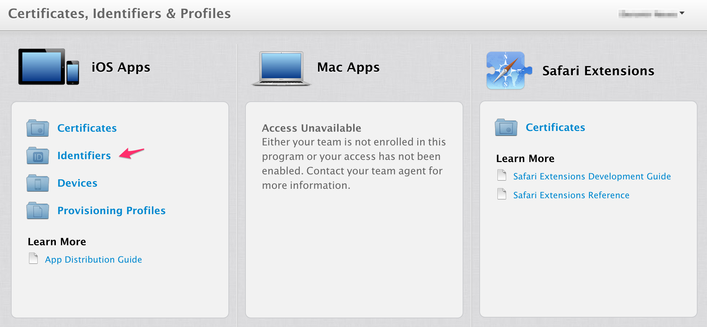
3. In the case you haven't registered your App ID yet, click on the '+' symbol and follow the instructions presented there. Do not forget to enable *Push Notifications*.
    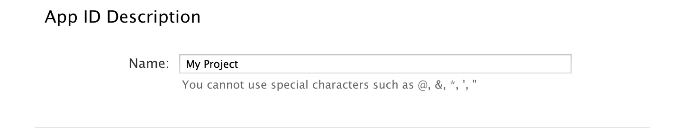
    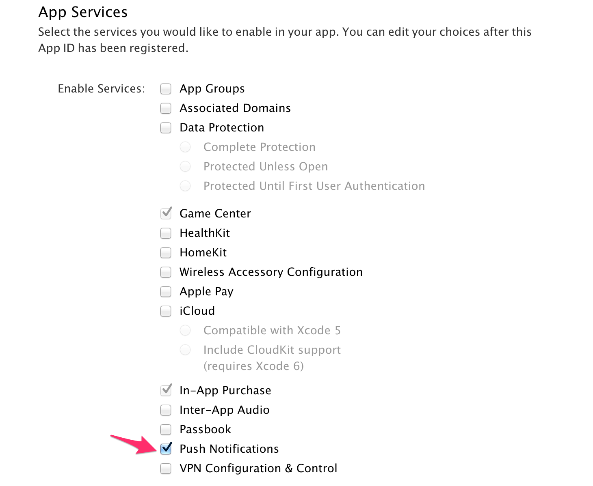
4. Create a Push Certificate.
  1. Select your application on the App IDs list and, then, click on the edit button. You will see all the services available for your application. In *Push Notifications* section, create a development certificate.
    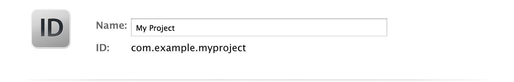
    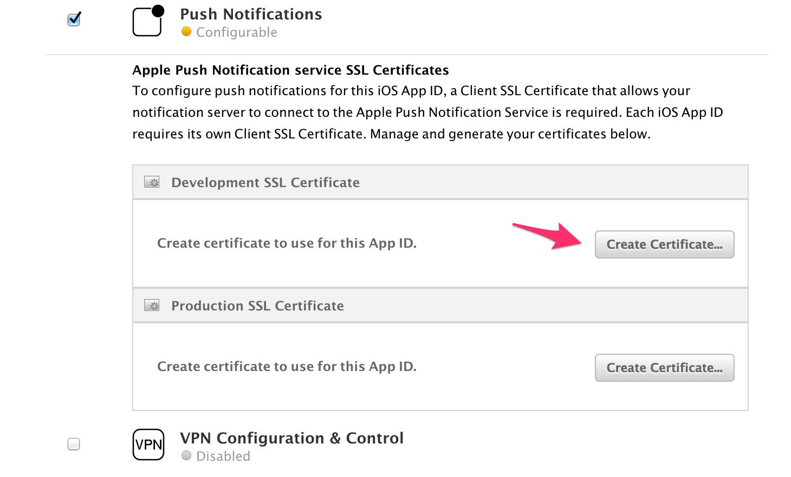
  2. Follow the presented instructions and download the certificate as an *aps_development.cert* file.
  3. Double-click the certificate and add it to your *Keychain*.

5. Export the certificate.
  1. With the Keychain Access application open, click on the certificate and select the option *Export "Apple Development IOS Push Services..."*.
  2. Select the option *Personal Information Exchange (.p12)*.

    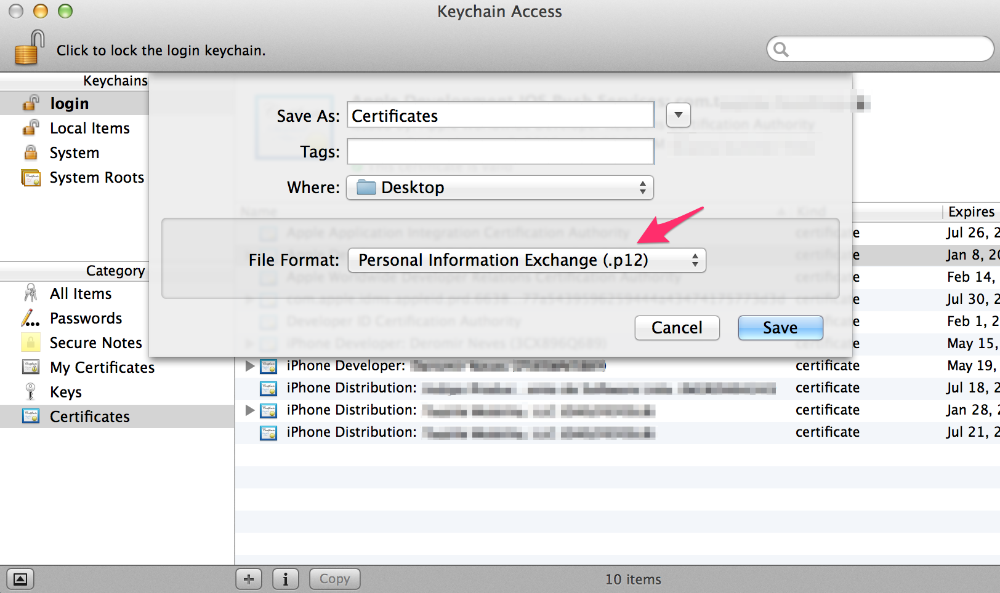
  3. A dialog will appear asking you to provide a **password** for the key.  
  4. Then store securely your **certificate.p12** file.

6. Both the **certificate.p12** and **password** are required for the TQ1 setup.

### Staging and Production
1. For the staging environment setup, use the same application created for development, whereas for production you should create a new one following the previous steps [1-5]
2. The only difference is that you should create an Apple Push Notification service SSL (Production) certificate instead of a Sandbox one.
    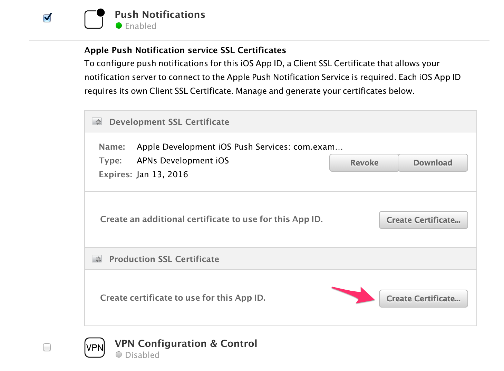
3. Both the **certificate.p12** and **password** are required for the TQ1 setup.

## MPNS for Windows Phone Silverlight 8.+

**This guide assumes that:**

- You have a Microsoft Account and you are registered in an App Developer. Otherwise you can follow [these instructions](https://dev.windows.com/en-us/join).

### Development and Staging

1. You should create a single application for both these environments.
2. Access the [Dashboard](https://dev.windows.com/en-us/dashboard) and select **Windows Phone Store**.
    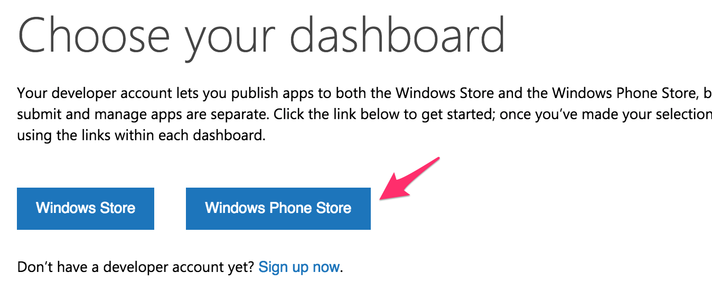
3. Click on the button **Submit App**.
    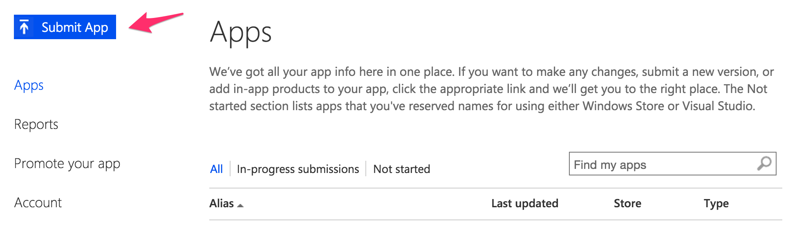
4. On the next screen, select **App info**.
    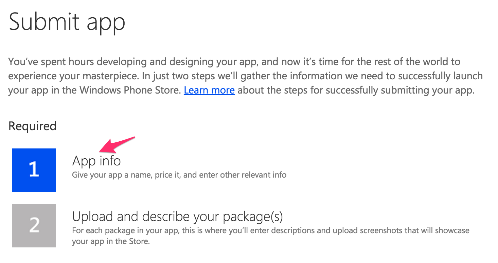
5. Reserve an app name for your application. Click on **More options** and select the option **Beta** distribution adding the emails of the beta testers.
    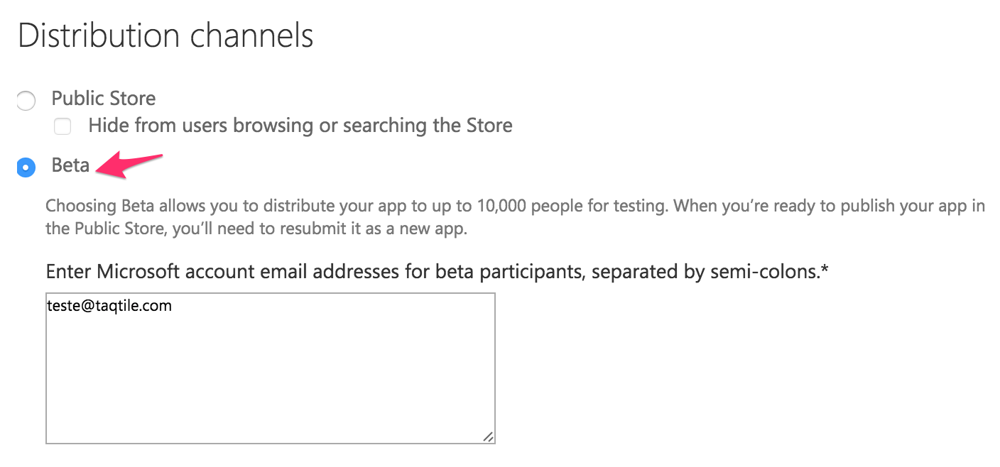

### Production

1. Follow the steps [2-5] from the previous environments with one difference: instead of using the **Beta** distribution, use **Public Store**.
    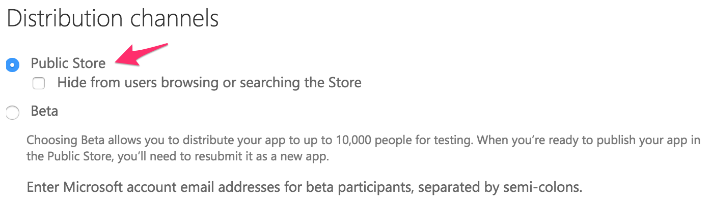

## WNS for Windows Phone Store

**This guide assumes that:**

- You have a Microsoft Account and you are registered in an App Developer. Otherwise you can follow [these instructions](https://dev.windows.com/en-us/join).

### Development and Staging

1. You should create a single application for both these environments.
2. Follow the steps [2-5] from the [MPNS guide](#mpns-for-windows-phone-silverlight-8).
3. On the main page of the **Dashboard** you can see a list of your applications. Select the one you've just created.
4. Select the **Details** tab.
    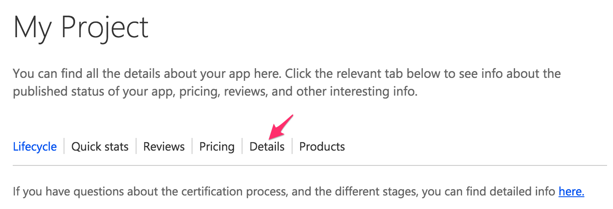
5. Scroll down and click on **Manage client secret**.
    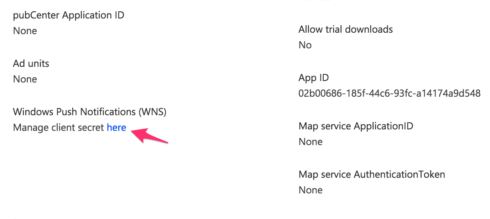
6. Then you will be presented to the WNS credentials for your application.
    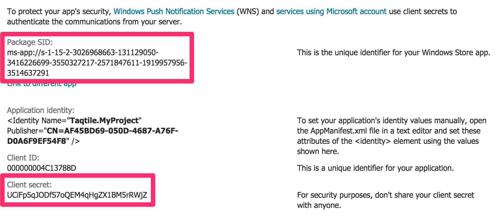
7. Both **Package SID** and **Client secret** are required for the TQ1 setup.

### Production

1. Follow the steps [2-6] from the previous environments with one difference: instead of using the **Beta** distribution, use **Public Store**.
2. Both **Package SID** and **Client secret** are required for the TQ1 setup.


## AWS - SNS Users

All user permissions can and should be tested using [AWS Policy Simulator Tool](https://policysim.aws.amazon.com/home/index.jsp?#)

### Development

In order to the SNS development user be able to properly access the SNS App

1. SNS App must end with the `development` string
2. iOS SNS App **MUST** be `SANDBOX` type

### Staging/Production

After SNS apps are created and setup by project we must:

1. Create SNS user for staging and production with the following names: `tq1-<app name>-<staging/production>`
2. Both staging and production IAM users must have an inline policy granting access to the specific staging **OR** production apps, using the following policy as a template:
```
{
    "Version": "2012-10-17",
    "Statement": [
        {
            "Sid": "Stmt1423835774000",
            "Effect": "Allow",
            "Action": [
                "sns:Publish",
                "sns:CreatePlatformEndpoint",
                "sns:SetEndpointAttributes",
                "sns:ListEndpointsByPlatformApplication"
            ],
            "Resource": [
                "arn:aws:sns:us-east-1:951644756174:app/GCM/appname-staging",
                "arn:aws:sns:us-east-1:951644756174:app/APNS/app-name-staging"
            ]
        }
    ]
}
```
Note that for staging and production apps, the usage of wildcards is highgly discouraged, and we should list explicitily the apps that the user has access to.
3. Add the user key and secret to passpack using the following name: `TQ1 - AWS - <App name> - <Staging or Production>` and transfer the ownership to `Taqtile`

**DO NOT** use your personal AWS key in any app (even development), if any user access besides the apps are found in the log auditions, the key might be inactivated.
